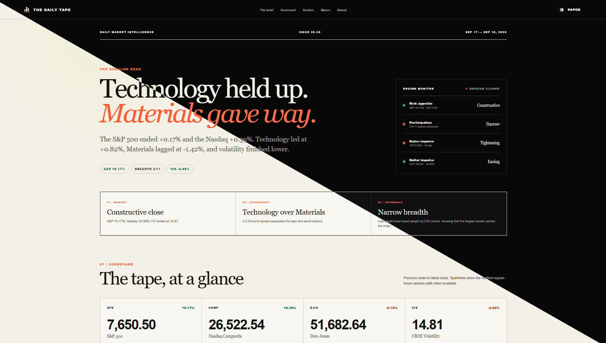
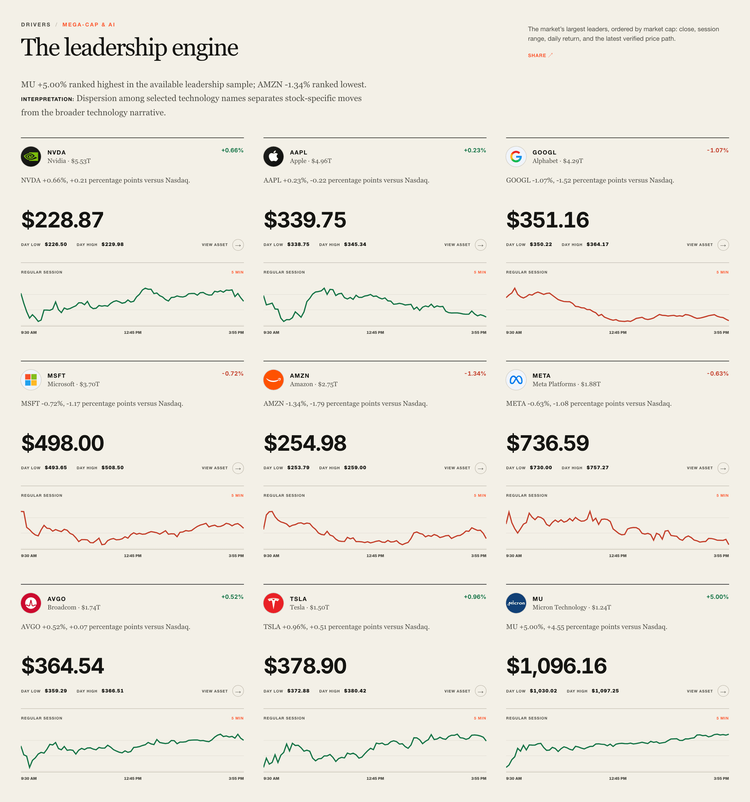
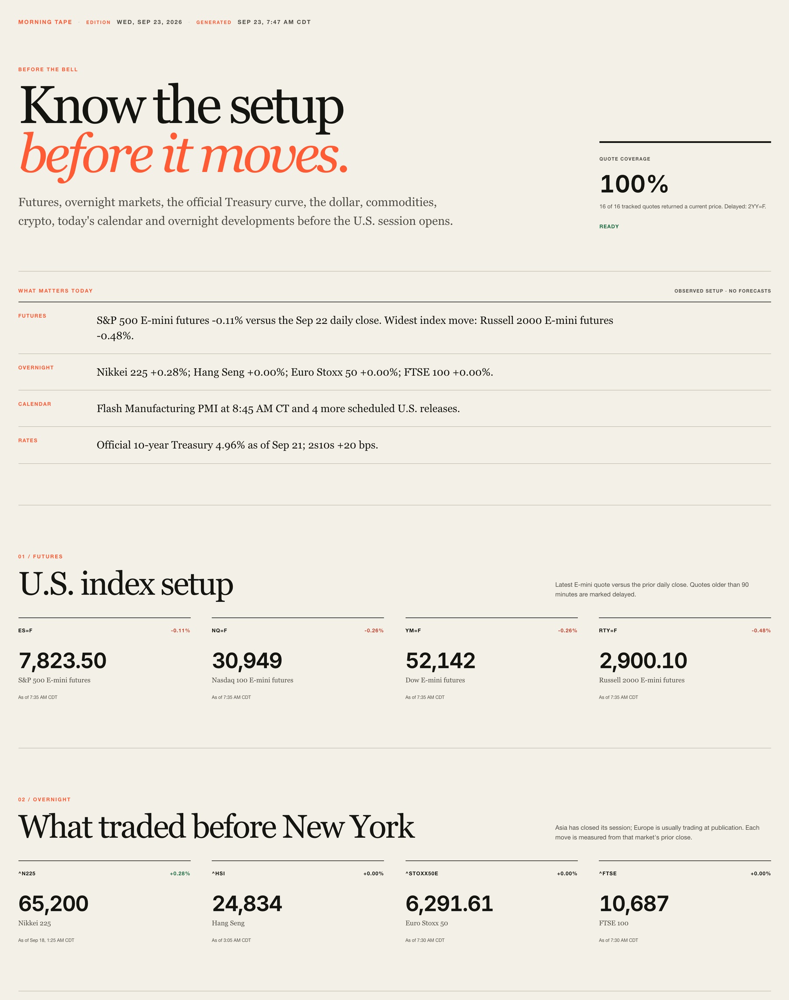
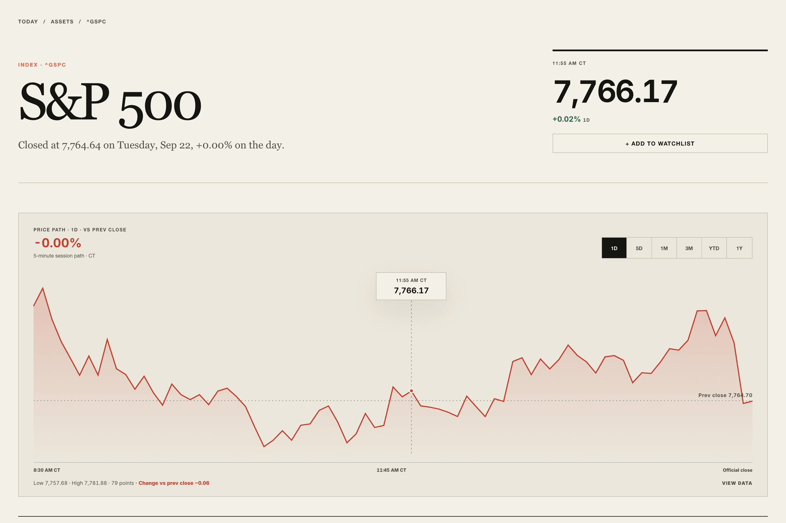
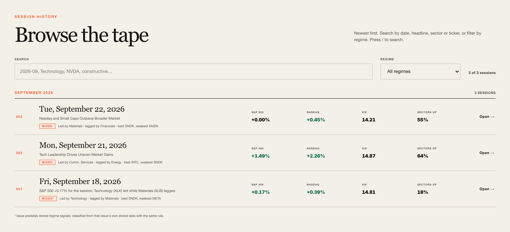

<div align="center">


# The Daily Tape

**A daily U.S. market briefing: the setup before the open and the full read after the close.**

### [Open the live dashboard →](https://coolxng.github.io/market-summary/)

[](https://github.com/coolxng/market-summary/actions/workflows/deploy-pages.yml)

</div>

<p align="center">
  
</p>

<p align="center">
  <a href="https://coolxng.github.io/market-summary/">Live Dashboard</a> ·
  <a href="https://coolxng.github.io/market-summary/morning/">Morning Tape</a> ·
  <a href="https://coolxng.github.io/market-summary/reports/">Archive</a> ·
  <a href="https://coolxng.github.io/market-summary/feed.xml">RSS</a>
</p>

The Daily Tape has two editions: the **Morning Tape** before the open and the **Close Tape** after the session.

> **Publishes every U.S. trading day.** Morning Tape at about 7:45 AM CT. Close Tape from about 3:30 PM CT, after the 3:00 PM CT close.

## Why The Daily Tape?

The Daily Tape puts indexes, sectors, rates, breadth, crypto, releases and headlines on one page, so you do not have to check each separately.

- **See the whole market, not just the S&P 500:** sectors, rates, commodities, global equities and crypto beside the indexes.
- **Tell broad moves from concentrated ones:** participation and equal-weight checks show how many names carried the move.
- **See leadership and cross-asset signals together:** sector ranks and mega-caps next to yields, credit and the dollar.
- **Come back later:** every completed session is permanently archived.

## Follow along

- **Bookmark** the [live dashboard](https://coolxng.github.io/market-summary/). It always opens on the latest Close Tape.
- **Subscribe** to the [RSS feed](https://coolxng.github.io/market-summary/feed.xml) for each new Close Tape.
- **Install it as an app.** In Safari on iPhone or iPad, tap Share, then Add to Home Screen. In Chrome on Android, use the install or add-to-home-screen option in the browser menu.

The app never stores pages or report data offline, so it cannot show a stale session. Offline, it shows a notice.

## Product tour

### Market overview

A headline, a regime monitor (risk appetite, participation, rates, dollar), three takeaways and an index scorecard tell you what kind of session it was.

### Sector leadership

All 11 sector ETFs are ranked by session return. Relative strength against SPY over 1D, 5D and 1M shows which leaders are persistent and which are one-day moves.

### Leadership Engine

<p align="center">
  
</p>

Nine of the largest U.S.-listed growth stocks (NVDA, AAPL, GOOGL, MSFT, AMZN, META, AVGO, TSLA, MU), ordered by market cap. Each card shows return versus the Nasdaq, close, day range and session path; a summary names the strongest and weakest. That shows whether mega-cap leadership moved together or split. It is an unweighted sample, not index contribution.

### Morning Tape

<p align="center">
  
</p>

U.S. futures versus the prior close, overnight Asia and Europe, the Treasury curve, the dollar, commodities, crypto, today's calendar and overnight catalysts. Quotes older than 90 minutes are marked delayed.

### Asset pages

<p align="center">
  
</p>

Each of the 89 tracked assets has a page with a 1D to 1Y chart you can inspect by pointer, touch or keyboard, plus its session and 52-week range, 20-, 50- and 200-day averages, tagged catalysts and recent archived sessions.

### Archive and search

<p align="center">
  
</p>

Every completed session has a permanent page at `/reports/YYYY-MM-DD/`. Search by date, headline, sector or ticker, filter by regime, and step between sessions to compare them.

### Watchlist

Save up to 20 tracked assets. The list is stored only in your browser.

### Keyboard shortcuts

Press `?` on any page for its shortcuts: `/` searches, `A` opens the archive, `←` `→` step between sessions, and single letters jump to sections.

## What it tracks

- **Markets:** S&P 500, Nasdaq Composite, Dow, VIX, 10-year yield, DXY, Bitcoin and Ethereum.
- **Sectors and leadership:** 11 sector ETFs, relative strength versus SPY, and nine mega-cap leaders.
- **Internals:** participation measured on named, tracked universes.
- **Rates and credit:** Cboe yield indexes, the official Treasury curve and actual credit spreads.
- **Macro calendar and catalysts:** releases, auctions, earnings and source-linked developments.
- **Cross-asset:** gold, crude oil, global indexes, Bitcoin, Ethereum, Solana and XRP, each with its own session date.
- **Data health:** a status for each issue and source.

<details>
<summary><b>Regime history</b></summary>

60 sessions of Constructive, Mixed and Defensive classifications. Days published in an archived issue are shown as published; other days are reconstructed from daily closes with the same rule and labeled as reconstructed.

</details>

<details>
<summary><b>Internals</b></summary>

Sectors advancing, equal versus cap weight (1D, 5D, 1M), sector ETFs above their 20-, 50- and 200-day averages, 20-session highs and lows, and a sector advance/decline line. Every measure names its tracked universe. Exchange-wide NYSE and Nasdaq breadth is listed as not covered rather than approximated.

</details>

<details>
<summary><b>Rates and credit</b></summary>

Cboe yield indexes and the official Treasury par curve (2Y, 2s10s, 3M to 10Y, 5s30s, real yields). Credit uses actual ICE BofA option-adjusted spreads from FRED. Bond ETFs are labeled as price proxies, not spreads.

</details>

<details>
<summary><b>Macro calendar and catalysts</b></summary>

U.S. releases (actual, consensus, previous), Treasury auctions, tracked earnings and NYSE market-structure dates for today and the next session, in Central Time. Catalysts come first from the Federal Reserve, BLS and BEA, then from an exact allowlist of publishers.

</details>

## How the data works

- Every verified catalyst carries its source, link and timestamp, and none is presented as the cause of a move.
- Unavailable values are stored as null, not zero, and shown as unavailable.
- Prices must pass sanity bounds, and rows from a different session than the report are rejected.
- Each source reports its status, and every issue has a data health strip (Verified, Partial, Some feeds unavailable or Limited).
- If the narrative model is unavailable or disabled, the report uses deterministic copy built from the same data. Figures always come from the data, not the model.

## How it works

```text
Railway cron
    │
    ▼
railway_cron.py
    │
    ▼
generate_report.py
    ├─ resolves the latest completed U.S. session
    ├─ downloads market data with yfinance
    ├─ validates core prices and sanity bounds
    ├─ builds index, sector, breadth, macro, crypto, and intraday data
    ├─ adds calendar, catalysts, Treasury curve and credit spreads (failures are non-fatal and recorded)
    ├─ computes internals, relative strength and 60-session regime history
    └─ generates market commentary
    │
    ▼
report_snapshot.json
public/reports/YYYY-MM-DD/report.json
    │
    ▼
validated artifacts are committed to main
    │
    ▼
GitHub Pages workflow
    │
    ▼
Next.js static export → live dashboard
```

| Area | Implementation |
| --- | --- |
| Market data | Yahoo Finance through `yfinance`, with Stooq as a fallback for core indexes |
| Report generation | Python |
| Frontend | Next.js 16, React 19, TypeScript |
| Scheduled publishing | Railway cron jobs |
| Hosting | GitHub Pages |
| Narrative layer | Claude Sonnet 5, with deterministic fallback copy |

## Data notes

Data quality depends on upstream availability. Validation does not guarantee every upstream quote is error-free, so verify important market information independently before making financial decisions.

The Daily Tape is informational only and is not financial advice.

© 2026 coolxng. All rights reserved.
